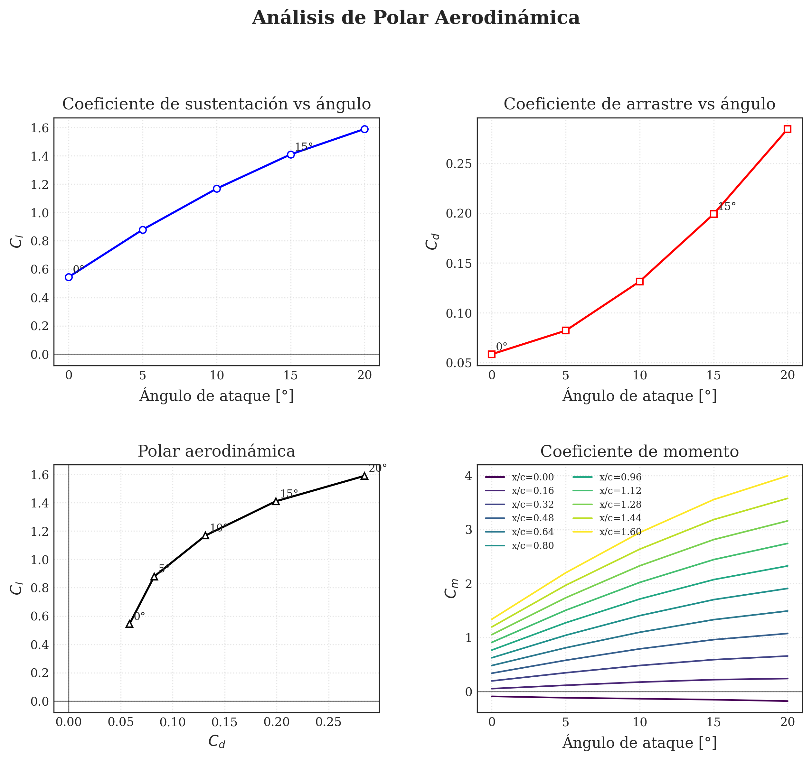

# Aircraft Aerodynamic Analysis (CFD) 
Este proyecto contiene el estudio aerodinámico de un ala de aeronave mediante simulaciones de barrido de ángulos de ataque ($AoA$).

##  Herramientas Utilizadas
* **Solver:** OpenFOAM (`simpleFoam`)
* **Mallas:** `snappyHexMesh` para geometrías complejas.
* **Automatización:** Scripts en Bash (`RunAngle.sh`) para ejecución en serie de casos.
* **Análisis de Datos:** Python (`graficadora.py`) para la generación de polares.

##  Resultados
Se analizaron los coeficientes de sustentación ($C_L$), resistencia ($C_D$) y momento ($C_m$) desde 0° hasta 30°.

